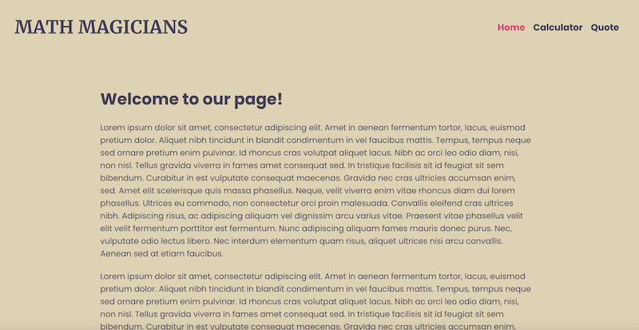
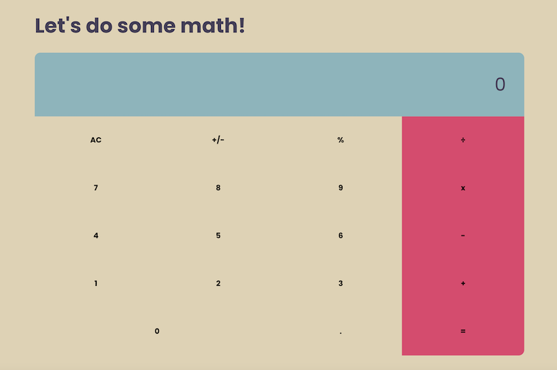

# Math Magicians

"Math magicians" is a website for all fans of mathematics. It is a Single Page App (SPA) that allows users to:

- Make simple calculations.
- Read a random math-related quote.

## Built With

- ReactJS

## Live Demo

### Netlify

[Netlify Live Demo Link](https://keen-wozniak-e38afe.netlify.app/calculator)

## Installation

Go to your terminal, navigate to your working directory and run

`git clone https://github.com/anuarshaidenov/math-magicians.git`

After that navigate to the newly created folder

`cd math-magicians`

You now have access to the files.
To install necessary dependencies run

`npm install`

Start a local server running the command

`npm start`

You should now have the project running locally on a dev server.

## Authors

👤 **Anuar Shaidenov**

- GitHub: [@anuarshaidenov](https://github.com/anuarshaidenov)
- Twitter: [@anuarnyi](https://twitter.com/anuarnyi)
- LinkedIn: [LinkedIn](https://www.linkedin.com/in/anuar-shaidenov-365a951b8/)

## 🤝 Contributing

Contributions, issues, and feature requests are welcome!

Feel free to check the [issues page](../../issues/).

## Show your support

Give a ⭐️ if you like this project!

## 📝 License

This project is [MIT](./MIT.md) licensed.
